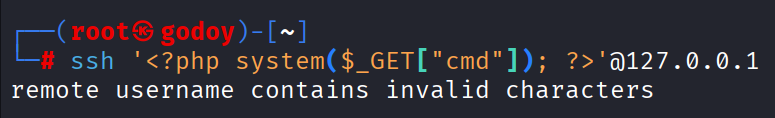
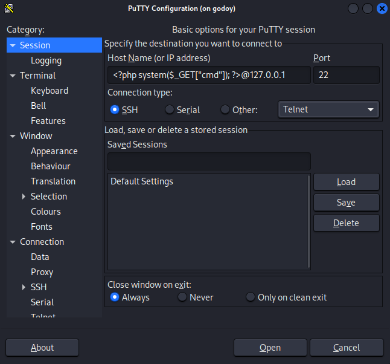

# SSH Invalid Username Bypass

A simple workaround for the OpenSSH error:

```text id="j8r1os"
remote username contains invalid characters
```

This can be relevant when testing **SSH log poisoning**, where attacker-controlled input is written to SSH authentication logs.

---

## OpenSSH Error

When attempting to use a username containing special characters with OpenSSH, the client rejects it:

```text id="s0d5x7"
remote username contains invalid characters
```

<p align="center">
  
</p>

---

## Bypass with PuTTY

On Debian-based systems, install PuTTY with:

```bash
sudo apt update
sudo apt install putty
```

Open PuTTY and enter the username and target IP directly in the **Host Name** field using:

```text
<USERNAME>@<TARGET_IP>
```

Keep the connection type as **SSH** and the port as **22**.

<p align="center">
  
</p>


---

## SSH Log Poisoning

After connecting through PuTTY, the username appears in the SSH authentication log:

<p align="center">
  
</p>

---

## Summary

| Client  | Result              |
| ------- | ------------------- |
| OpenSSH | ❌ Username rejected |
| PuTTY   | ✅ Username accepted |

The restriction is enforced by the **OpenSSH client**, rather than being an inherent limitation of the SSH server.

---

## Disclaimer

This repository is intended for educational purposes and authorized security testing only.
